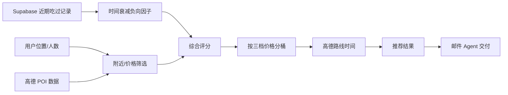

# Restaurant Recommender Agent

基于附近地理位置与高德地图数据，按三档价格范围推荐餐厅，并排除最近吃过的食物相关店铺。

## 行为

- 根据用户位置与半径筛选附近餐厅
- 使用评分/距离等字段计算综合评分（若无评分则降权）
- 正向：距离 / 价格 / 人数匹配
- 负向：最近吃过的食物与店铺（随时间衰减）
- 按价格区间（3 档）输出 Top 推荐
- 输出路线时间与推荐菜单（若数据源提供）

## 数据源与集成

- 位置/路线/餐厅数据：高德 Web 服务 API
  - POI 周边搜索：`https://restapi.amap.com/v3/place/around`
  - 路线规划：`/v3/direction/driving`、`/v3/direction/walking`、`/v3/direction/transit/integrated`
- 最近吃过记录：Supabase（见下方表结构）

## 使用

```bash
python agents/restaurant_recommender/agent.py --input input.json --output output.json
```

## Streamlit 前端（定位 + 推荐 + 选中回写）

```bash
.venv/bin/python -m streamlit run ui/streamlit_app.py
```

在“Food Picks”页签中会自动定位并生成推荐，选择餐厅会写入 Supabase。

## Poetry 使用

```bash
poetry run python agents/restaurant_recommender/agent.py --input input.json --output output.json
```

## 输入格式（JSON）

```json
{
  "user": { "lat": 31.2304, "lng": 121.4737 },
  "user_id": "u-001",
  "party_size": 2,
  "radius_km": 3.0,
  "amap_keywords": "火锅",
  "amap_types": "050000",
  "recent_history": {
    "foods": [{ "name": "火锅", "ate_at": "2025-01-10T12:00:00+08:00" }],
    "restaurants": [{ "name": "老张火锅", "ate_at": "2025-01-12T19:30:00+08:00" }]
  },
  "price_ranges": [
    { "label": "budget", "min": 0, "max": 50 },
    { "label": "mid", "min": 50, "max": 120 },
    { "label": "premium", "min": 120, "max": 9999 }
  ],
  "restaurants": [
    {
      "id": "dp-001",
      "name": "阿美餐厅",
      "lat": 31.229,
      "lng": 121.471,
      "price": 88,
      "rating": 4.6,
      "review_count": 532,
      "categories": ["本帮菜"],
      "dishes": ["红烧肉"],
      "address": "上海市XX路",
      "source": "amap"
    }
  ]
}
```

## 配置

- `agents/restaurant_recommender/config/config.yaml`
- 价格口径：`price_mode = per_person | total`，配合 `party_size`
- Supabase 密钥：`agents/restaurant_recommender/config/supabase.yaml`（本地明文，不入库；包含 service_role_key/anon_key 注释）
- 高德 Key：`agents/restaurant_recommender/config/amap.yaml`（本地明文，不入库）

## Supabase 表结构（最简）

recent_foods:
- user_id (text)
- food (text)
- ate_at (timestamp)

recent_restaurants:
- user_id (text)
- restaurant (text)
- ate_at (timestamp)

## 架构图


